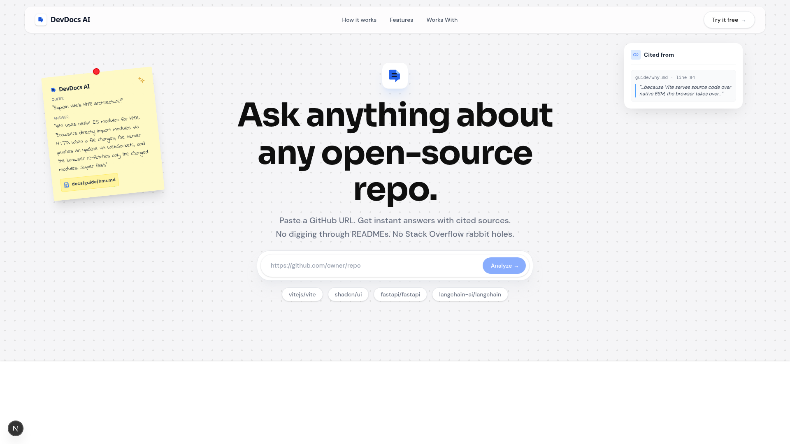
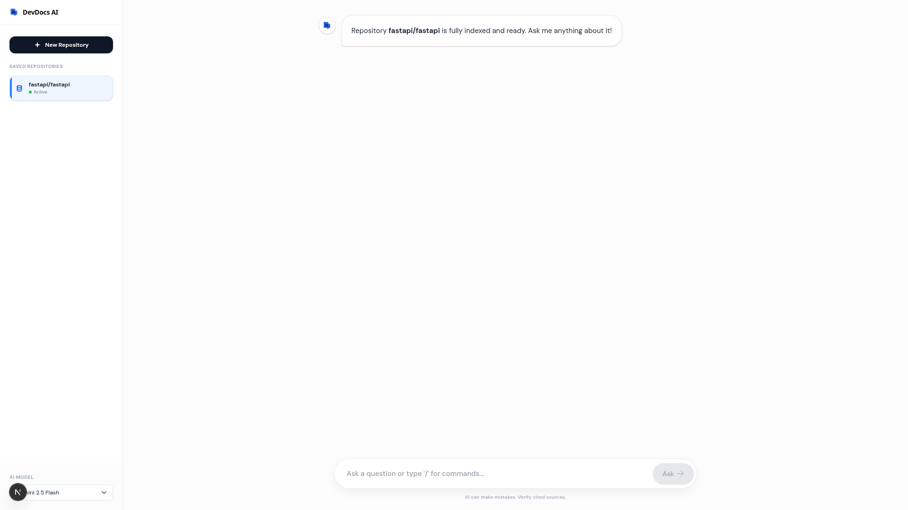

# DevDocs AI

DevDocs AI turns a public GitHub repository into a conversational, source-aware documentation assistant. Paste a repository URL, let the ingestion pipeline index its documentation, and ask focused questions with source links included in the response.

## Product overview

- Next.js frontend with a responsive landing page and chat workspace
- FastAPI backend for crawling GitHub documentation, embedding content, and retrieving context
- ChromaDB for local persistent vector storage
- Gemini for embeddings and streamed answers
- Evaluation assets and RAG documentation kept under dedicated folders

## Product preview

The landing page introduces the workflow, while the chat workspace provides repository ingestion, streamed answers, and source links.

| Landing page | Chat workspace |
| --- | --- |
|  |  |

## Architecture

```text
Browser → Next.js (Vercel) → FastAPI API (Railway / Render)
                              ├─ GitHub tree + raw-content APIs
                              ├─ Gemini embeddings + chat generation
                              └─ ChromaDB persistent storage
```

The frontend calls `/api/v1/*`. Next.js rewrites those requests to `NEXT_PUBLIC_API_URL`, so the browser never needs to know the backend route directly.

## Requirements

- Node.js 20 or newer
- Python 3.10 or newer
- A Google AI Studio API key

## Local development

```bash
git clone https://github.com/arjun-713/DevDocs-AI.git
cd DevDocs-AI
cp .env.example .env
npm ci
python3 -m venv .venv
source .venv/bin/activate
pip install -r backend/requirements.txt
npm run dev
```

The frontend runs at `http://localhost:3000`; the API runs at `http://localhost:8000`. Set `GOOGLE_API_KEY` in `.env` before using ingestion or chat.

To run services separately:

```bash
npm run dev:frontend
npm run dev:backend
```

## Environment variables

| Variable | Service | Required | Description |
| --- | --- | --- | --- |
| `GOOGLE_API_KEY` | Backend | Yes | Google Gemini API key for embeddings and responses |
| `GEMINI_API_KEY` | Backend | No | Backward-compatible alias for `GOOGLE_API_KEY` |
| `NEXT_PUBLIC_API_URL` | Frontend | Production | Public URL of the deployed FastAPI service, without a trailing slash |

Never commit `.env` or API keys. Use the hosting provider’s encrypted environment variables for production.

## Deployment

Deploy the frontend from the repository root as a Next.js project. Configure `NEXT_PUBLIC_API_URL` with the deployed backend URL. Deploy the `backend/` directory as a Python service with:

```bash
pip install -r requirements.txt
uvicorn app.main:app --host 0.0.0.0 --port $PORT
```

See [docs/deployment.md](docs/deployment.md) for the complete Vercel and backend checklist.

## Repository layout

```text
app/                 Next.js routes and UI components
backend/app/         FastAPI routes and RAG services
backend/scripts/     Backend diagnostics and smoke scripts
docs/                Architecture, API, and deployment documentation
EVAL_DOCS/           Evaluation methodology and CI notes
tests/evals/         Evaluation code and datasets
public/              Static brand assets
```

## Documentation

- [Architecture](docs/architecture.md)
- [API reference](docs/api.md)
- [Backend guide](docs/backend.md)
- [Frontend guide](docs/frontend.md)
- [RAG pipeline](docs/rag-pipeline.md)
- [Deployment](docs/deployment.md)

## Quality checks

```bash
npm run lint
npm run typecheck
npm run build
```

## License

This project is currently intended for development and evaluation. Add a license before distributing it as a public production product.
