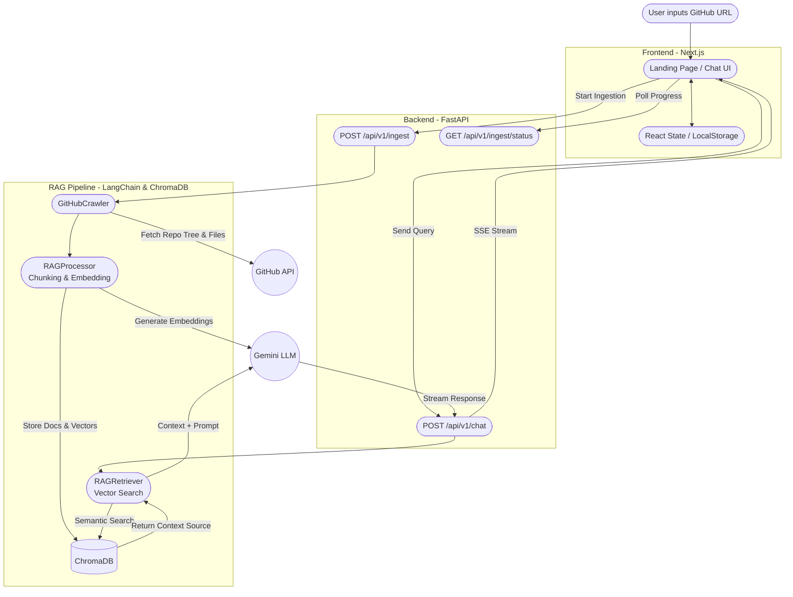

# System Architecture

This document provides a high-level overview of the DevDocs AI system, illustrating how data flows from the user's initial repository input to the final AI-generated response.

## Table of Contents

- [High-Level Flow](#high-level-flow)
- [System Components](#system-components)
  - [Frontend (Next.js)](#frontend-nextjs)
  - [Backend (FastAPI)](#backend-fastapi)
  - [RAG Engine (LangChain + ChromaDB)](#rag-engine-langchain--chromadb)
  - [LLM Service (Google Gemini)](#llm-service-google-gemini)

## High-Level Flow

The following Mermaid diagram outlines the end-to-end data flow:

## System Components

### Frontend (Next.js)

The user interface is built using Next.js (App Router), React, and Tailwind CSS.
- **Responsibility**: Provides a sleek, interactive chat surface and landing page. Manages states like the active repository, chat history, and the selected Gemini model.
- **Key Features**: Smooth CSS animations, full markdown rendering (`ChatMarkdown`), message actions (copy, like, dislike, regenerate).

### Backend (FastAPI)

The API layer is built with FastAPI, providing asynchronous endpoints for both ingestion and chatting.
- **Responsibility**: Handles HTTP requests from the frontend, orchestrates the background ingestion tasks, and manages streaming responses for the chat.
- **Endpoints**:
  - `/api/v1/ingest`: Triggers the background ingestion worker.
  - `/api/v1/ingest/status/{collection}`: Fast lookup for ingestion progress reporting.
  - `/api/v1/chat`: Handles user queries, runs the retriever, formats the prompt, and returns Server-Sent Events (SSE).

### RAG Engine (LangChain + ChromaDB)

The core logic that powers the Retrieval-Augmented Generation.
- **GitHubCrawler**: Asynchronously fetches repository file trees using the GitHub API, filters for documentation files (`.md`, `.rst`, etc.), and downloads raw contents using a semaphore to avoid rate limits.
- **RAGProcessor**: Splits the raw text into manageable chunks (`RecursiveCharacterTextSplitter`) and generates vector embeddings.
- **RAGRetriever**: Searches ChromaDB for the chunks most semantically similar to the user's query.
- **ChromaDB**: An in-process vector database stored locally (`/data`) that holds the embeddings and metadata (source URLs) for fast retrieval.

### LLM Service (Google Gemini)

We utilize Google's Gemini family of models (via LangChain's Google GenAI integration).
- **Responsibility**: Provides text embeddings during ingestion (`gemini-embedding-001`) and logical reasoning/answer generation during the chat phase (e.g., `gemini-2.5-flash`).
- **Features**: Highly capable context window and streaming support for real-time UI updates.
